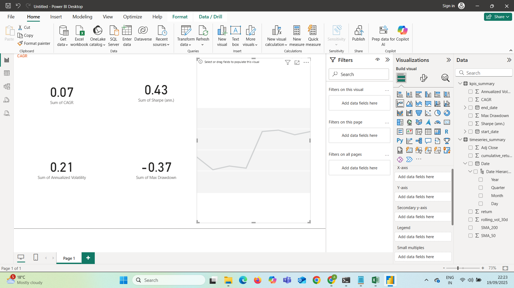

# 📊 Finance Dashboard – Stock Market Analysis  

This project builds an **end-to-end financial analytics pipeline** using **Python, Excel, and Power BI**.  
It covers data ingestion, financial KPIs calculation, and interactive dashboard visualizations for stock market analysis.  

---

## 🔹 Project Workflow  

1. **Data Source**  
   - Input: `yahoo_data.xlsx` (stock price data from Yahoo Finance).  

2. **Data Processing (Python)**  
   - `ingest.py`: Cleans and prepares raw stock data.  
   - `analytics.py`:  
     - Calculates returns, volatility, and cumulative returns.  
     - Generates technical indicators (SMA 50, SMA 200).  
     - Computes financial KPIs (CAGR, Sharpe ratio, Max Drawdown).  
   - Outputs:  
     - `processed_prices.csv`  
     - `timeseries_summary.csv`  
     - `kpis_summary.csv`  

3. **Visualization (Matplotlib & Power BI)**  
   - Python generates static charts:  
     - `price_sma.png`  
     - `cumulative_return.png`  
     - `rolling_volatility.png`  
   - Power BI builds an **interactive dashboard** with KPIs, trend analysis, and risk-return visuals.  

---

## 🔹 Power BI Dashboard  

### **1. Overview Page**  
- KPIs: CAGR, Annualized Volatility, Sharpe Ratio, Max Drawdown  
- Screenshot:  
  

### **2. Trend Analysis Page**  
- Time-series of Adj Close, SMA 50, SMA 200  
- Cumulative returns by year  
- Screenshot:  
  

### **3. Risk & Returns Page**  
-  Max Drawdown, SMA 50 vs SMA 200 by year  
- Screenshot:  
  


---

## 🔹 Repository Structure  

Finance-Dashboard-Stock-Analysis/
│── ingest.py # Script to clean raw data
│── analytics.py # Script to calculate KPIs & generate charts
│── yahoo_data.xlsx # Raw input data
│── processed_prices.csv # Cleaned dataset
│── timeseries_summary.csv # Returns, SMA, rolling vol
│── kpis_summary.csv # KPIs (CAGR, Sharpe, Drawdown)
│── price_sma.png # Price with SMA chart
│── cumulative_return.png # Cumulative returns chart
│── rolling_volatility.png # Volatility chart
│── Overview.png # Power BI Overview page
│── Trend Analysis.png # Power BI Trend page
│── Risk & Returns.png # Power BI Risk page
│── README.md # Project documentation


---

## 🔹 How to Run  

### **1. Run Python Scripts**
```bash
python ingest.py
python analytics.py

